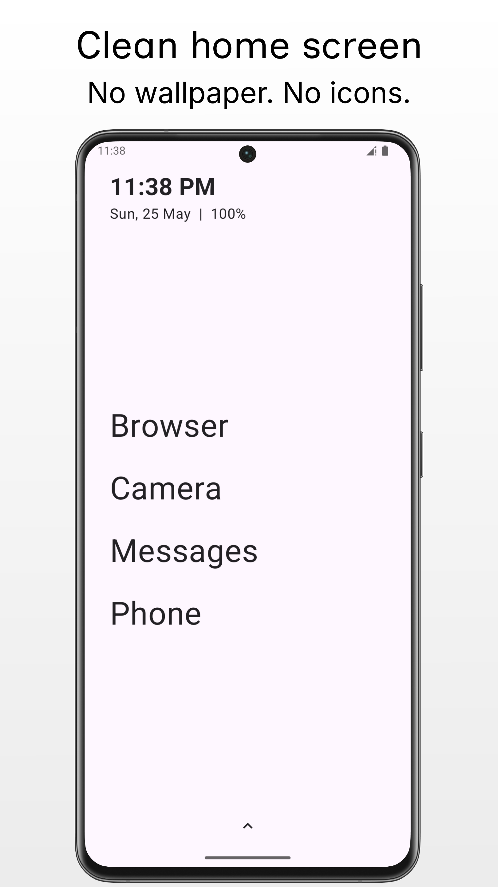
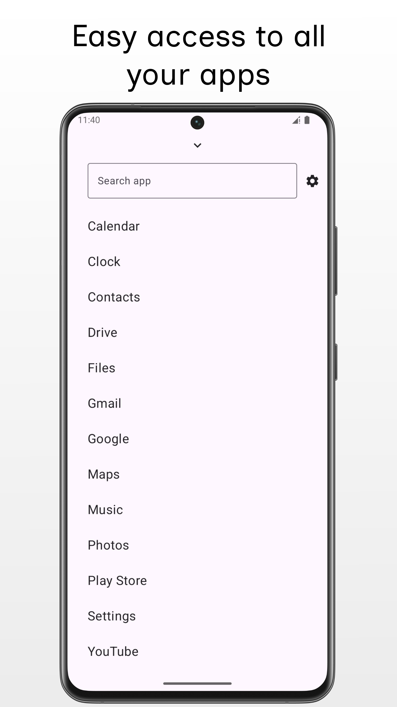
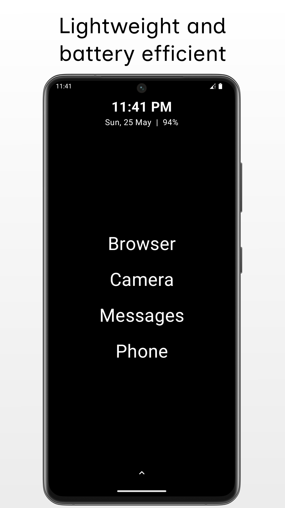
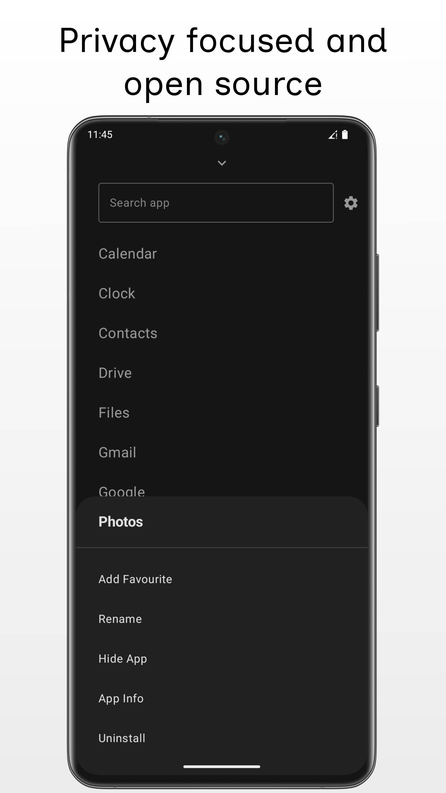

# Minimo

Designed for users who want to de-clutter their home screen, Minimo offers a clean and intuitive
interface that prioritizes functionality without unnecessary distractions.

No wallpaper. No icons. No distractions.

## Screenshots:

  
  
  

  
  
  

## Key Features:

- **App Management**: Personalize your app experience by favourite apps, renaming apps and hiding
  those you don’t use frequently, keeping your home screen tidy and organized.
- **Lightweight Performance**: Minimo is designed to be resource-efficient, ensuring smooth
  operation without draining your battery.
- **Privacy Focused**: Your data is yours. We don’t track or collect personal information.
- **Open Source**: Our app is open source, allowing you to review the code, contribute, and ensure
  transparency in our development process.

## Download:

## Tech stack & Libraries

- Minimum SDK level 26.
- Target SDK level 35.
- [Kotlin](https://kotlinlang.org/) based,
  utilizing [Coroutines](https://github.com/Kotlin/kotlinx.coroutines) + [Flow](https://kotlin.github.io/kotlinx.coroutines/kotlinx-coroutines-core/kotlinx.coroutines.flow/)
  for asynchronous operations.
- Jetpack Libraries:
  - [Jetpack Compose](https://developer.android.com/compose)
  - [Lifecycle](https://developer.android.com/jetpack/androidx/releases/lifecycle)
  - [ViewModel](https://developer.android.com/topic/libraries/architecture/viewmodel)
  - [Navigation](https://developer.android.com/guide/navigation)
  - [Room](https://developer.android.com/jetpack/androidx/releases/room)
  - [DataStore](https://developer.android.com/jetpack/androidx/releases/datastore)
  - [Hilt](https://dagger.dev/hilt/)
- [Timber](https://github.com/JakeWharton/timber)

## My socials:

[X/Twitter](https://x.com/VaibhavLakhera)
[LinkedIn](https://www.linkedin.com/in/vaibhav-lakhera/)
